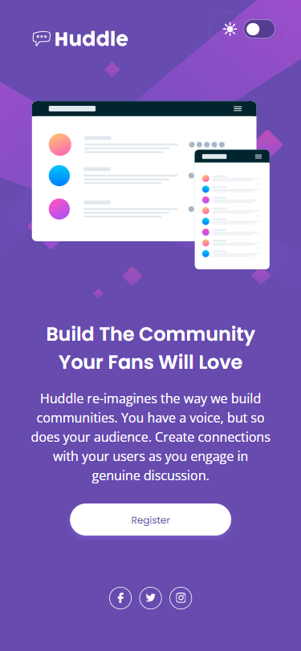
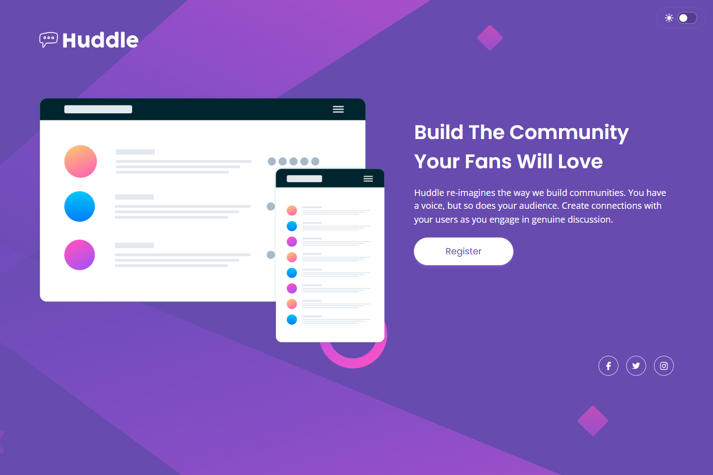
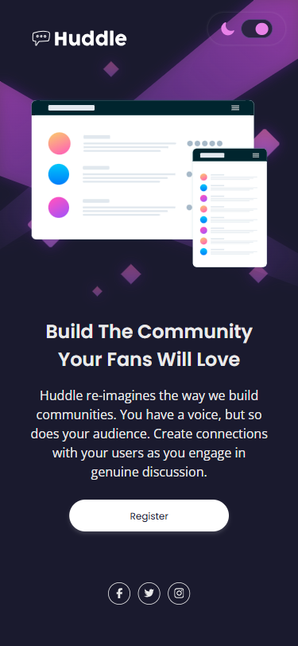
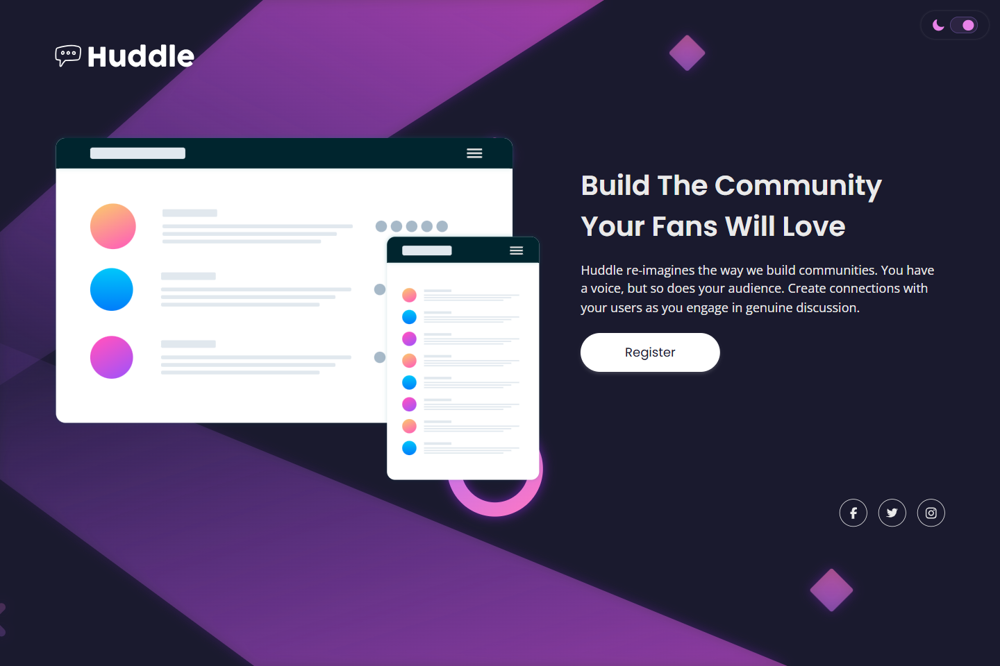

# 💻 Huddle Landing Page

## ℹ️ A Responsive Landing Page for a Fictional Huddle Company

| _Mobile Preview (375x812)_                                   | _Desktop Preview (1440x960)_                                    |
| ------------------------------------------------------------ | --------------------------------------------------------------- |
|       |       |
|  |  |

This project is a clean, responsive landing page for a fictional company called **Huddle**. It features semantic HTML structure, light/dark theme support, accessible navigation, and polished styling with CSS custom properties.

Created as part of the building challenges from [Frontend Mentor](https://www.frontendmentor.io/).

---

## 🔍 Overview

The Huddle Landing Page challenge provided a mockup to recreate using only HTML, CSS, and minimal JavaScript. The final build includes a functional dark mode toggle with smooth transitions, accessible skip links, and responsive layout optimized for both mobile and desktop viewports.

The project uses semantic elements throughout, respects accessibility best practices, and adapts to user preference for reduced motion. Google Lighthouse was used to verify performance, accessibility, and SEO.

---

## ✨ Features

- Fully responsive layout (mobile-first)
- Semantic HTML5 structure
- Accessible skip links and social icons
- Theme toggle with light/dark mode
- CSS custom properties for easy theming
- Smooth transitions for theme switching
- Optimized background illustrations for each theme
- ARIA-labels and visually hidden texts for screen readers
- Google Lighthouse performance audit

---

## 🧠 What I Learned

- Creating accessible navigation with skip links and `aria-label`
- Building fully responsive components using `clamp()`, media queries, and flexible layout techniques
- Designing theme-aware UI with custom properties (`:root` and `.dark`)
- Applying drop shadow dynamically with class toggling
- Accessibility-first development mindset (screen readers, focus-visible, reduced motion)
- Refining code organization by separating visual themes from structure

---

## 🛠️ Tech Used

- HTML5
- CSS3
- JavaScript (minimal)
- Git
- GitHub
- Netlify

---

## 🎨 Design Reference & Tools

- JPG design image
- PerfectPixel

---

## 🚀 How to Run

1. Clone the repository
2. Open `index.html` in your browser

---

## 🌐 Live Demo

Or you can check out the 👉 [live website here](LINK)

---

## 📊 Performance Report

A **Google Lighthouse** audit was conducted on the final version of this project. You can view the full report [here](./assets/downloads/lighthouse-performance-report.pdf).

---

## 🧑‍💻 Author

Created by **Elmar Chavez**

🗓️ Month/Year: **July 2025**

📚 Journey: **4th** month of learning _frontend web development_.

<!--

FRONTEND MENTOR TAGS:
html css vscode git github netlify 4th-month frontend-mentor project perfectpixel lighthouse theme-toggle

-->
